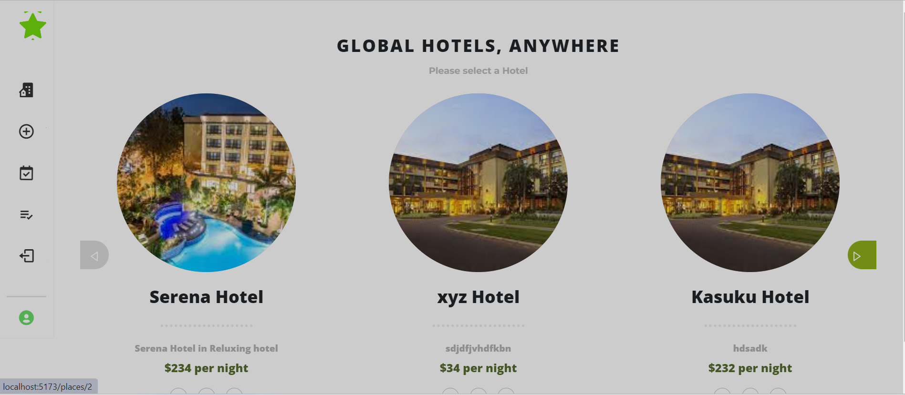
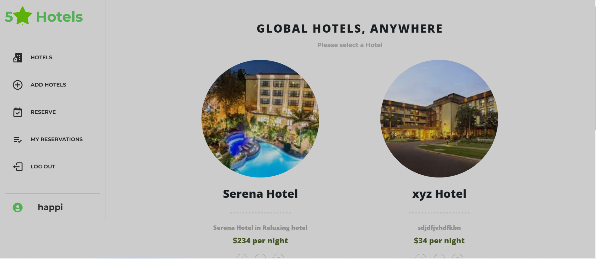
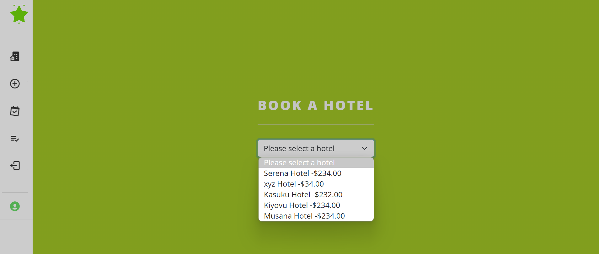
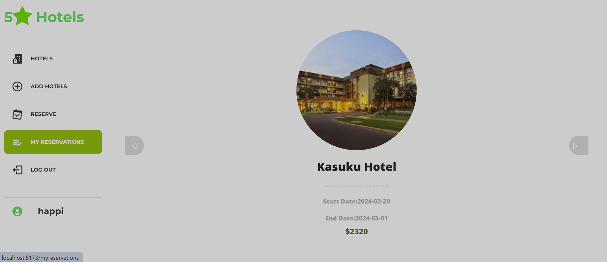
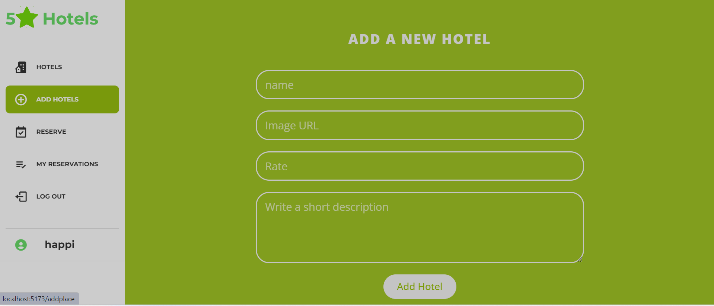
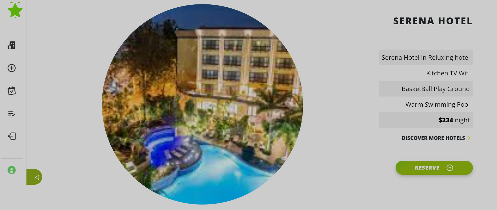

# 🏩 finalGroupCapstone-frontend
<div align="center">
  <h1><b>Book an appointment | Hotels</b></h1>
  
  
  
  
  
  
</div>
# 📗 Table of Contents

- [🏩 finalGroupCapstone-frontend](#-finalgroupcapstone-frontend)
- [📗 Table of Contents](#-table-of-contents)
- [📖 Book a Hotel ](#-book-a-hotel-)
  - [🛠 Built With ](#-built-with-)
    - [Tech Stack ](#tech-stack-)
    - [Key Features ](#key-features-)
  - [💻 Getting Started ](#-getting-started-)
    - [Prerequisites](#prerequisites)
    - [Setup](#setup)
    - [Install](#install)
    - [💾 Database](#-database)
    - [Usage](#usage)
    - [Run tests](#run-tests)
  - [👥 Authors ](#-authors-)
  - [🔭 Future Features ](#-future-features-)
  - [🤝 Contributing ](#-contributing-)
  - [⭐️ Show your support ](#️-show-your-support-)
  - [🙏 Acknowledgments ](#-acknowledgments-)
  - [📝 License ](#-license-)

# 📖 Book a Hotel <a name="about-project"></a>

> The Book a Hotel 🏩, our API will provide functionality to create, read, and destroy data related to hotels. It will serve as the server-side component responsible for handling requests and managing the database. The React client will interact with the backend to perform actions such as creating new hotels and reservations, see the hotel details, and removing hotels from the system.

## 🛠BackEnd Deployed link: <a>
https://book-an-appointment-cmm0.onrender.com/
</a>

## 🛠 Backend link: <a>
https://github.com/IvonneBenitesRodriguez/finalGroupCapstone-backend/pull/25
</a>

 API documentation:
[API DOC](https://book-an-appointment-cmm0.onrender.com/api-docs/v1/swagger.yaml)

## 🛠 Built With <a name="built-with"></a>

### Tech Stack <a name="tech-stack"></a>

<details>
  <summary>Client</summary>
    <ul>
    <li><a href="https://react.dev/">React</a></li>
    <li><a href="https://redux.js.org/">Redux</a></li>
  </ul>
</details>
<details>
  <summary>Server</summary>
  <ul>
    <li><a href="https://rubyonrails.org/">Ruby on Rails</a></li>
  </ul>
  </details>
  <details>
  <summary>Database</summary>
  <ul>
    <li><a href="https://www.postgresql.org/">PostgreSQL</a></li>
  </ul>
</details>

### Key Features <a name="key-features"></a>

- **Data Model**

<p align="right">(<a href="#readme-top">back to top</a>)</p>

<p align="right">(<a href="#readme-top">back to top</a>)</p>

## 💻 Getting Started <a name="getting-started"></a>

To get a local copy up and running follow these simple example steps.

### Prerequisites

> You need the following tools be installed in your computer:

> - [Rails](https://guides.rubyonrails.org/)
> - [Git](https://www.linode.com/docs/guides/how-to-install-git-on-linux-mac-and-windows/)
> - [Ruby](https://github.com/microverseinc/curriculum-ruby/blob/main/simple-ruby/articles/ruby_installation_instructions.md)


### Setup

Clone this repository to your desired folder:

```sh
cd my-prefered-folder
  
git clone https://github.com/IvonneBenitesRodriguez/finalGroupCapstone-frontend.git

```

### Install

Install this project with:

```sh
cd finalGroupCapstone-frontend
  
npm init -y
npm install
```

### 💾 Database

Create the databases, run migrations, and populate it with seed data:

```sh
rails db:create
rails db:migrate
rails db:seed
```

### Usage

To run the project run the following commands:

```sh
npm start 
```
```sh
npm run dev
```
### Run tests

To run tests, run the following command:

```sh
npm run test 
```

<p align="right">(<a href="#readme-top">back to top</a>)</p>

## 👥 Authors <a name="author"></a>

👤 **Ivonne Benites**

- 🌷GitHub: [@githubhandle](https://github.com/IvonneBenitesRodriguez)
- 🌷Twitter: [@twitterhandle](https://twitter.com/IvonneBenitesR)
- 🌷LinkedIn: [LinkedIn](https://www.linkedin.com/in/ivonnebenites/)
  
👤 **Gilbert Dushimimana Happi**

- Github: [Gilbert Happi Dushimimana](https://github.com/gilberthappi)
- X: [Gilbert Happi Dushimimana](https://twitter.com/DushimimanaGil3)
- LinkedIn: [Gilbert Happi Dushimimana](https://www.linkedin.com/in/dushimimana-gilbert-happi-997b2a262/)

<p align="right">(<a href="#readme-top">back to top</a>)</p>

## 🔭 Future Features <a name="future-features"></a>

- [ ] **Complete the CRUD for places and reservations.**

<p align="right">(<a href="#readme-top">back to top</a>)</p>

## 🤝 Contributing <a name="contributing"></a>

Contributions, issues, and feature requests are welcome!

Feel free to check the [issues page](https://github.com/IvonneBenitesRodriguez/finalGroupCapstone-backend/issues).

<p align="right">(<a href="#readme-top">back to top</a>)</p>

## ⭐️ Show your support <a name="support"></a>

If you like this project please give it a star 😁🌟✨

<p align="right">(<a href="#readme-top">back to top</a>)</p>

## 🙏 Acknowledgments <a name="acknowledgements"></a>

We thank to [Murat Korkmaz](https://www.behance.net/muratk) for the marvelous [design](https://www.behance.net/gallery/26425031/Vespa-Responsive-Redesign).

<p align="right">(<a href="#readme-top">back to top</a>)</p>

## 📝 License <a name="license"></a>

This project is [MIT](./LICENSE) licensed.

<p align="right">(<a href="#readme-top">back to top</a>)</p>

